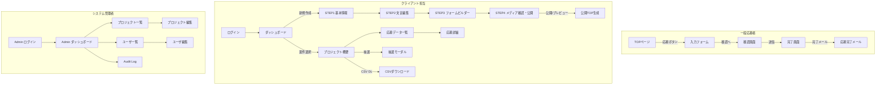

# レシートキャンペーンCMS

ノンエンジニアでも簡単にレシートキャンペーンサイトを作成できるCMSシステムです。

## 機能概要

### 管理者機能
- キャンペーンプロジェクトの作成・管理
- ユーザー管理
- 全プロジェクトの閲覧・編集・削除

### クライアント機能
- プロジェクトセットアップ（フォーム設定、画像アップロード）
- キャンペーン内容の編集
- プレビュー・テスト機能
- プロジェクト公開

### キャンペーンページ
- TOPページ（メインビジュアル + キャンペーン内容）
- アンケート・レシートアップロードフォーム
- 確認画面
- 完了画面

### 管理機能
- 応募データ一覧表示
- 簡易抽選機能
- CSVダウンロード
- レシート画像一覧表示

## 技術スタック
- HTML
- Tailwind CSS
- JavaScript (Vanilla)

## セットアップ

1. プロジェクトをクローン
2. `index.html`をブラウザで開く
3. 管理者としてログイン（初期ID: admin, パスワード: admin123）

## プロジェクト構造

```
retsu-m/
├── index.html              # メインエントリーポイント
├── admin/
│   ├── dashboard.html      # 管理者ダッシュボード
│   ├── projects.html       # プロジェクト管理
│   └── users.html          # ユーザー管理
├── client/
│   ├── setup.html          # プロジェクトセットアップ
│   ├── preview.html        # プレビュー機能
│   └── manage.html         # プロジェクト管理
├── campaign/
│   ├── top.html            # キャンペーントップページ
│   ├── form.html           # アンケート・アップロードフォーム
│   ├── confirm.html        # 確認画面
│   └── complete.html       # 完了画面
├── assets/
│   ├── css/
│   ├── js/
│   └── images/
└── docs/
    ├── sitemap.md          # サイトマップ
    └── progress.md         # 開発進捗
```

## 開発進捗

詳細な進捗状況は `docs/progress.md` を参照してください。


